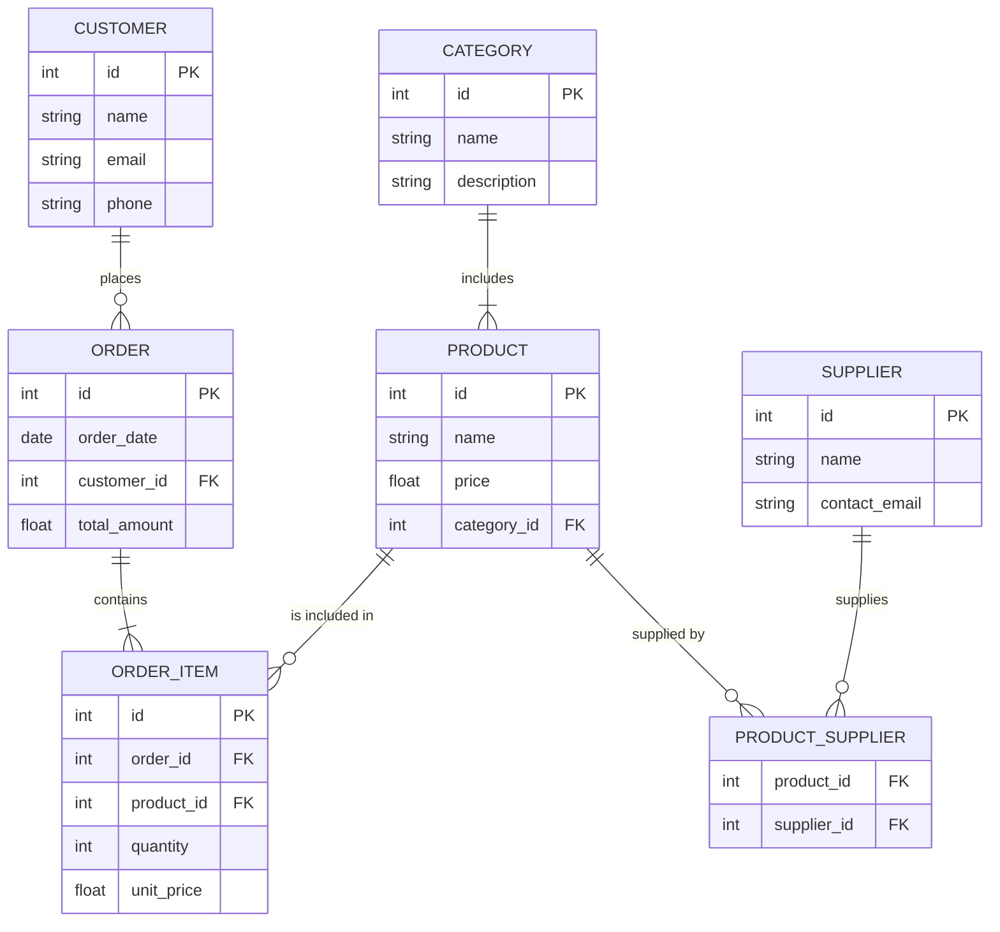
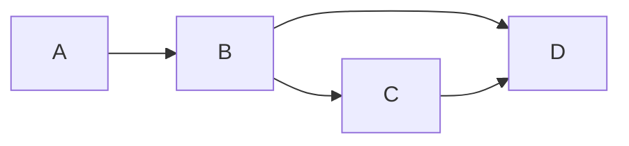

---
tags:
  - author/martijn
---

Welkom bij Obsidian. Met deze documentatie tool gaan we bijhouden en documenteren wat we hebben gemaakt. Dit doen we omdat we willen dat iedereen kan snappen wat je hebt gemaakt. Want op deze manier kan iemand makkelijker iets uitbreiden wat een ander heeft gemaakt. 

In dit bestand volgt een uitleg over hoe obsidian werkt, en hoe we een structuur behouden.

## Onze Structuur

In de zijbalk kan je de folders en bestanden zien, we willen hier in de feature folder een folder van welke feature het is, bijvoorbeeld: `login and register`, in dit voorbeeld zijn ze gecombineerd omdat het bijna het zelfde is, maar meestal zet je hier dus 1 ding neer. In deze folder maak je een bestand met een specifiekere naam, in mijn geval is dat `Functional LoginPage`, want we kunnen meer documentatie hebben over het zelfde onderwerp.

In je bestand voeg je jouw naam toe aan de properties, net zoals dat dit bestand #author/martijn heeft, omdat ik het heb geschreven. Bij aanpassingen van een al bestaand artikel zet je hier ook je eigen naam tussen. Verder zet je erbij of het over front-end of back-end gaat, en andere hashtags die mogelijk betrekking hebben.

Als je documentatie schrijft over 1 onderwerp blijf je onder dat onderwerp schrijven, dus als je artikelen gaat over `katten` ga je niet opeens over `kaas` praten in het zelfde bestand. Hiervoor maken we een nieuw bestand.

Verder willen we diagrammen maken op canvas, dit wordt geplaatst in de `Schemas` folder. Op zo'n canvas kan je alles wat je in een notitie kan, en je kan zelfs notities inladen.

## Hoe werkt Obsidian

In obsidian schrijf je met de taal [markdown](https://en.wikipedia.org/wiki/Markdown), dit is leesbare text die je kan formatteren. Zoals dit linkje wat hiervoor stond, dat heb ik zo gedaan: `[markdown](https://en.wikipedia.org/wiki/Markdown)`.

als je met re rechter muisknop klikt op je obsidian artikel kan je op een simpelere manier dit toevoegen: 
![[Pasted image 20250318111616.png]]
Dit is handig voor als je nog niet weet hoe [markdown](https://en.wikipedia.org/wiki/Markdown) werkt.

>[!Important]- Tip
>
>Als je iets wat je hebt laten invoegen selecteert, kan je zien hoe het werkt:
>
>![[Pasted image 20250318111904.png]]
>
>Verder kan je ook rechts boven (of rechtsonder op het pennetje) in op de 3 puntjes source mode aanzetten, zo kan je ook zien hoe het werkt:
>
>![[Pasted image 20250318111845.png]]

### Linking

In obsidian kan je makkelijk artikelen aan mekaar koppelen, dit is handig want zo kan je verwijzen naar documentatie van iets anders, zodat je niet 100x het zelfde hoeft te omschrijven.

![[index#Internal Links]]

### Properties

Je kan properties toevoegen aan een notitie, dit is handig want an kan je bijvoorbeeld filteren op #front-end of op #author/martijn 
Je kan eindeloos veel tags maken, maar hou het wel logisch.

Hier is hoe je ze toevoegt:

![[Pasted image 20250318112506.png|300]]

en dan kan je ze onder tags toevoegen:

![[Pasted image 20250318112524.png]]


# Obsidian Markdown Cheat Sheet

Hier is een lijst met wat obsidian markdown kan, het meeste hiervan is universal markdown.


## Internal Links

Hiermee kan je 2 documenten aan mekaar linken.

```md
[[Page Title]] 
[[Page Title#Specific Header|Custom Link Text]]
[[index#Tags|Ferrum 56]]
[[index|Amai]]
```

[[index#Tags|Ferrum 56]]
[[index|Amai]]

## Tags

```
#front-end 
```

#front-end 

## Transclusion

Werkt het zelfde als [[index#Internal Links]], maar dan wordt het ingeladen. Zodra het ingeladen stuk dan wordt aangepast zie je ook de aanpassingen op de plekken waar het ingeladen wordt.

<sub>Maak AUB geen bestand wat zichzelf helemaal importeert.</sub>

```md
![[Embed File]]
![[index#Tags]]
```

![[index#Tags]]

# Markdown Cheat Sheet

## Headers

```md
# Header 1 
## Header 2 
### Header 3 
#### Header 4 
##### Header 5 
###### Header 6
```
## Emphasis

```md
*italic* or _italic_ 
**bold** or __bold__
```

*italic* or _italic_ 
**bold** or __bold__
## Lists

### Unordered List

```md
- Item 1 
- Item 2   
	- Subitem 2.1   
	- Subitem 2.2 
* Item 3
```

- Item 1 
- Item 2   
	- Subitem 2.1   
	- Subitem 2.2 
* Item 3

### BulletPoint List

```md
- [ ] Item 1 
- [ ] Item 2   
	- [x] Subitem 2.1   
	- [ ] Subitem 2.2 
* [ ] Item 3
```

- [ ] Item 1 
- [ ] Item 2   
	- [x] Subitem 2.1   
	- [ ] Subitem 2.2 
* [ ] Item 3

### Ordered List

```md
1. Item 1
2. Item 2    
	1. Subitem 2.1    
	2. Subitem 2.2 
3. Item 3
```

1. Item 1
2. Item 2    
	1. Subitem 2.1    
	2. Subitem 2.2 
3. Item 3
## Links

```md
[Link text](URL)
```
## Images

```markdown
``
``
```


## Blockquotes

```markdown
> This is a blockquote.
```

> This is a blockquote.

## Callout

```
> [!NOTE] Title
> Contents

> [!Warning]- IMPORTANTE
> Wash your hands
```

> [!NOTE] Title
> Contents

> [!Warning]- IMPORTANTE
> Wash your hands

## Folded Text

Je kan dit alleen openklikken zonder edit mode.

```md
<details> 
<summary>Click to expand</summary>  

Content goes here.  

</details>
```

<details> 
<summary>Click to expand</summary>  

Content goes here.  

</details>

## Code

### Inline Code

```markdown
`inline code`
```

`inline code`

### Code Block

```md
	```python 
	def example_function():     
		print("Hello, Markdown!")
	```
```
Turns into:
```python 
def example_function():     
	print("Hello, Markdown!")
```


## Horizontal Line
(You need to remove the `.` because otherwise I wasn't able to display it.)
```markdown
.---
```

--------

## Tables

```markdown
| Header 1 | Header 2 | 
| ---------|----------| 
| Row 1, Col 1 | Row 1, Col 2 | 
| Row 2, Col 1 | Row 2, Col 2 |
```

| Header 1     | Header 2     |     |
| ------------ | ------------ | --- |
| Row 1, Col 1 | Row 1, Col 2 |     |
| Row 2, Col 1 | Row 2, Col 2 |     |
|              |              |     |

## Mermaid diagram

You can make db diagrams in obsidian code-blocks, but I think it's better to use `Canvas` for that. Look in the `Schemas` folder for those.

```
	```mermaid
	erDiagram
	    CUSTOMER {
	        int id PK
	        string name
	        string email
	        string phone
	    }
	    ORDER {
	        int id PK
	        date order_date
	        int customer_id FK
	        float total_amount
	    }
	    ORDER_ITEM {
	        int id PK
	        int order_id FK
	        int product_id FK
	        int quantity
	        float unit_price
	    }
	    PRODUCT {
	        int id PK
	        string name
	        float price
	        int category_id FK
	    }
	    CATEGORY {
	        int id PK
	        string name
	        string description
	    }
	    SUPPLIER {
	        int id PK
	        string name
	        string contact_email
	    }
	    PRODUCT_SUPPLIER {
	        int product_id FK
	        int supplier_id FK
	    }
	
	    %% Relationships
	    CUSTOMER ||--o{ ORDER : "places"
	    ORDER ||--|{ ORDER_ITEM : "contains"
	    PRODUCT ||--o{ ORDER_ITEM : "is included in"
	    CATEGORY ||--|{ PRODUCT : "includes"
	    PRODUCT ||--o{ PRODUCT_SUPPLIER : "supplied by"
	    SUPPLIER ||--o{ PRODUCT_SUPPLIER : "supplies"
	
	```
```





```
	```mermaid 
	graph LR   
	A --> B   
	B --> C
	B --> D
	C --> D
	```
```



## Search

Ik gok niet dat dit nuttig zal zijn, maar wie weet.

````md
```query
tag:#front-end OR tag:#back-end
```
````

```query
tag:#front-end OR tag:#back-end
```

## HTML

You can do more html than just the ones displayed, but I didn't feel the need to list every html element.

### Line Break

```markdown
This is a line<br>break.
```

This is a line<br>break.

### Buttons

```
This is a <kbd>Ctrl</kbd> Button. <kbd>Ctrl</kbd>+<kbd>Alt</kbd>+<kbd>Delete</kbd>
```

This is a <kbd>Ctrl</kbd> Button. <kbd>Ctrl</kbd>+<kbd>Alt</kbd>+<kbd>Delete</kbd>